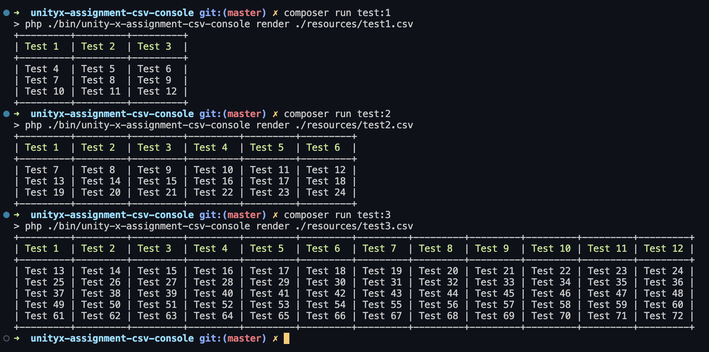

# CSV Console Reader

This application can render CSV files to the console. Use the app as explained below in the `How to use` section.

## How to use

1. Clone this repo.
2. Install dependencies: `composer install`.
3. Navigate to the repo folder: `cd csv-console-reader`.
4. Use as follows: `php ./bin/csv-console-reader render <path-to-your-csv-file>`.

> **_NOTE:_**  To quickly test this app, run `composer run test:1` in the repo folder. This will render a test CSV file included in the `/resources/` folder. You can also run `composer run test:2` and `composer run test:3` to test with the larger CSV test files.

### Options

You can specify three options for this app:

- File
- Delimiter
- Enclosure

The default values for delimiter and enclosure are `,` and `"` respectively. These options can be changed as follows:

- Change delimiter to `;`: 
    - `php ./bin/csv-console-reader render /path/to/file.csv --delimiter=";"`
    - Or `php ./bin/csv-console-reader render /path/to/file.csv -d ";"`
- Change enclosure to `'`:
    - `php ./bin/csv-console-reader render /path/to/file.csv --enclosure="'"`
    - Or `php ./bin/csv-console-reader render /path/to/file.csv -e "'"`
- Change both options:
    - `php ./bin/csv-console-reader render /path/to/file.csv --delimiter=";" --enclosure="'"`
    - Or `php ./bin/csv-console-reader render /path/to/file.csv -d ";" -e "'"`

### Versions

- Composer: 2.8.5
- PHP: 8.4.4

> **_NOTE:_**  As per the assignment, we are using an older version of Symfony Console (version 2.8). Because of this, some deprecation warnings have been silenced and dealt with. The existence of deprecations is visible in the unit tests for reference.

### Errors

1. `CSV must have at least 2 columns and 2 rows.`
    - Make sure your CSV file has more than 2 columns and rows. Also, make sure the delimiter of your CSV file is `,` (comma character).
2. `CSV file not found or unreadable.`
    - The file you are referencing to does not exist, or does not have the correct format (either not a CSV file, or a corrupted/badly formatted CSV file).

## Tests

To run the unit tests, run the following command: `composer run test:unit`.
